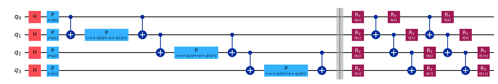

# Quantum Prognostics

Quantum and hybrid quantum–classical machine learning for **bearing fault diagnosis** and
**remaining useful life (RUL) estimation**, benchmarked against classical ML.



## Models
| Task | Quantum / hybrid | Classical baselines |
|---|---|---|
| Fault diagnosis (4 classes) | **QSVM** with amplitude encoding (as in the paper) or ZZ angle encoding, **VQC**, **QNN** (EstimatorQNN), **HQCNN** | SVM, Random Forest, MLP, ELM, Softmax |
| RUL regression | **QSVR** (quantum kernel), **HQCNN** | SVR, Random Forest, MLP |

**Pipeline**: vibration windows → 13 time/frequency features (RMS, kurtosis, crest/shape/impulse/clearance factors,
spectral centroid…) → standardise → PCA to *n* qubits → scale to [0, π] → ZZ feature map.
**HQCNN**: 1D CNN on the raw signal → *n* angles → parameterised quantum circuit (⟨Z<sub>i</sub>⟩ readout) → linear head,
trained end-to-end with PyTorch through `TorchConnector`.

## Repository Structure
```
Quantum-Prognostics/
├── Code/
│   ├── data.py                  # CWRU / XJTU-SY loaders, windowing, synthetic test signals
│   ├── features.py              # vibration features, PCA + angle encoding
│   ├── quantum_models.py        # QSVM (amplitude / ZZ), QSVR, VQC, QNN, HQCNN
│   ├── classical_models.py      # SVM/SVR, RF, MLP, ELM, Softmax
│   ├── run_fault_diagnosis.py   # classification benchmark
│   ├── run_rul.py               # RUL benchmark
│   ├── plot_circuits.py         # renders circuit figures
│   └── requirements.txt
├── Dataset/                     # CWRU and XJTU-SY download + layout
├── Figures/                     # feature map, ansatz, QNN circuit
├── Results/                     # published metrics, benchmark JSONs
├── LICENSE
└── README.md
```

## Quick Start
```bash
cd Code
pip install -r requirements.txt
python run_fault_diagnosis.py --synthetic         # smoke test, no downloads
python run_fault_diagnosis.py --data ../Dataset/CWRU
python run_rul.py --train ../Dataset/XJTU-SY/35Hz12kN/Bearing1_1 ../Dataset/XJTU-SY/35Hz12kN/Bearing1_2 \
                  --test  ../Dataset/XJTU-SY/35Hz12kN/Bearing1_3
```

## Publication
**Bearing Fault Diagnosis Using Quantum Machine Learning**, IEEE.  
[IEEE Xplore](https://ieeexplore.ieee.org/document/10712885/)

## Author
**Wajiha Rahim Khan**  
[Google Scholar](https://scholar.google.com/citations?user=ctvOkbYAAAAJ)

## License
MIT. See [LICENSE](LICENSE).
